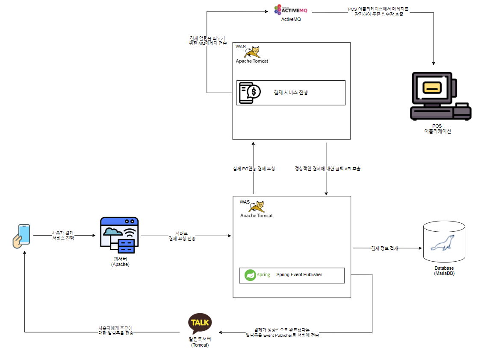

## 프로젝트 목표

- 다양한 배달 대행사 서비스를 효율적으로 연동할 수 있는 플랫폼 구축   
- 대행사의 추가를 고려한 확장 가능한 시스템 설계  
- 실시간 배달 상태를 사용자 화면에 제공하여 사용자 경험 개선  

### 기대효과 
>
>전략 패턴을 활용한 설계로 개발 시간 단축 및 확장성 증대 
>ActiveMQ를 활용한 실시간 상태 변경으로 사용자 만족도 향상 
>중복 로그인 방지 및 JWT를 이용한 사용자 인증 강화를 통해 보안성 및 서비스 신뢰도 제고 
>시스템 유지보수성과 성능 개선을 통해 서비스 안정성 강화
>

## 아키텍처 및 서비스 흐름

## 개발 스택
> 백엔드: Java, Spring Boot, Spring Data JPA, QueryDSL   
> 프론트엔드: Vue.js  
> 데이터베이스: MySQL, Redis  
> 기타: ActiveMQ, JWT  

## 핵심 기능 
>
> N개의 배달 대행사 서비스 연동 및 확장성을 고려한 전략 패턴 설계  
> 실시간 배달 상태 변경을 화면에 노출하기 위한 API 설계 및 개발  
> JWT를 이용한 사용자 인증 및 Redis를 활용한 중복 로그인 방지 기능  
> 웹 서버 프록시 설정 변경으로 요청 최적화  
> Wide/Narrow 타입 이미지의 Center Crop 및 비율 조정 기능 개발
